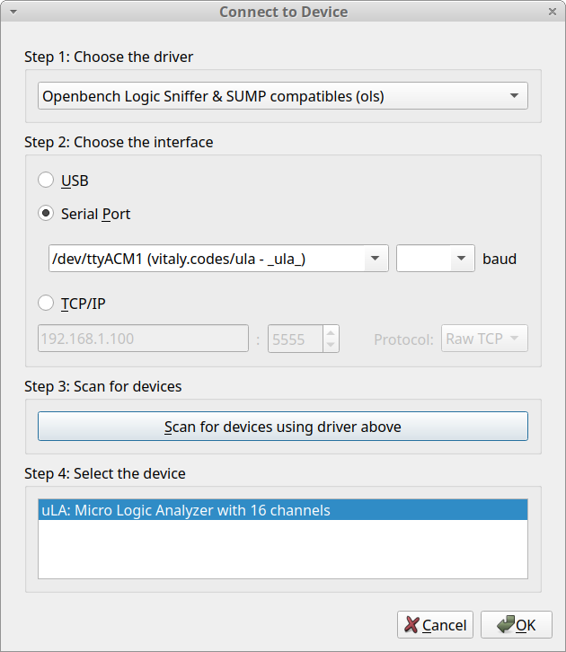

Commissioning
==============================

.. image:: /images/work-in-progress.svg
   :height: 200px
   :align: center

.. code-block:: bash

   sudo apt install pulseview sigrok
   sigrok-cli --version
   0.7.2
   pulseview --version
   0.4.2

.. code-block:: bash

   # Flash PICO_INFRA
   op commissioning

   # Flash PICO_PROBE
   testbed_cb_jtag_probe flash-logic-analyzer

   # Flash cp_jtag_probe
   testbed_cb_jtag_probe flash-jtag

Run micropython test code to experiment with flash-logic-analyzer
------------------------------------------------------------

.. code-block:: bash

   testbed_cb_jtag_probe flash-jtag --firmware-url=https://micropython.org/resources/firmware/RPI_PICO2-20260406-v1.28.0.uf2
   op power --on dut --on proberun
   op query
   mpremote connect /dev/ttyACM2 run experiments/micropython_ula_test_main.py
   ~/experiment/experiment_sigrok/appimage_sigrok/pulseview-NIGHTLY-x86_64-debug.AppImage

