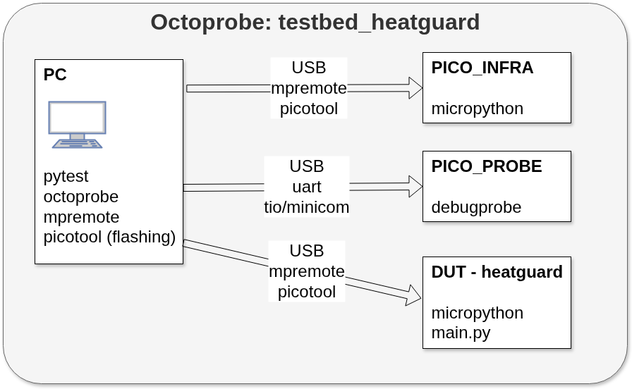
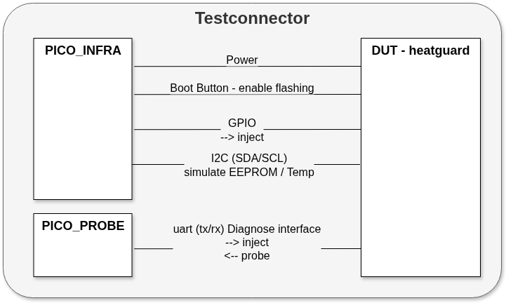

Overall control
================

**PC - PICO_INFRA**

There is heavy communication calling micropython on PICO_INFRA using mpremote.

**PC - DUT**

At test start

   * mpremobe verifies the version of the micropython firmware and if needed, updates it using picotool.
   * mpremote copies `main.py` to the DUT.
   * Now the DUT is powercycled and the test may begin.

During the test, the is NO communication via mpremote to the DUT!

Test Connector
-------------------------

