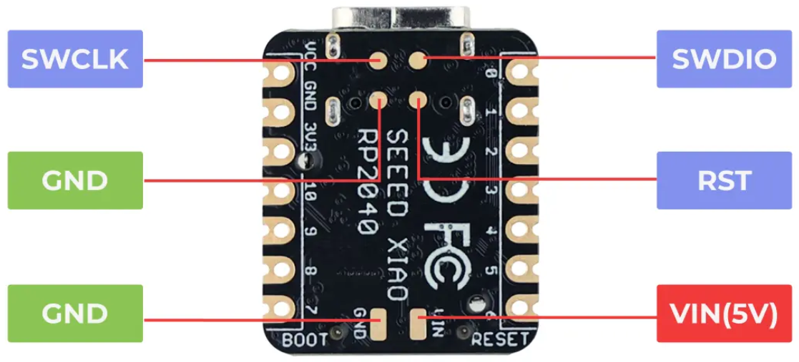
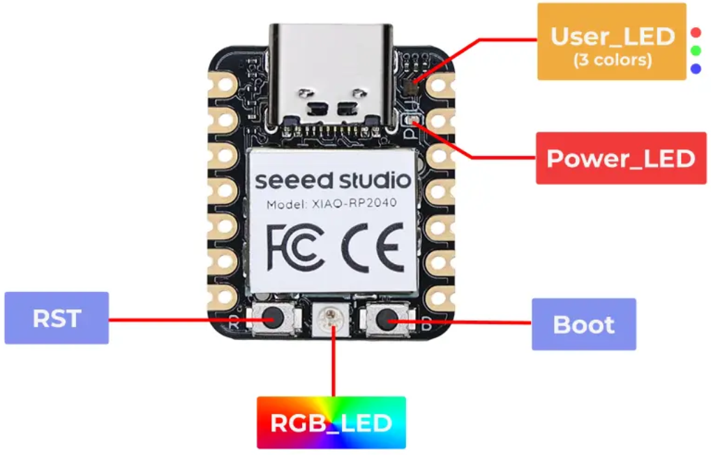
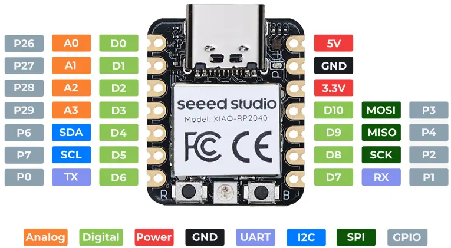

Components
===========================

XIAO RP2040
-------------------------

`XIAO RP2040 Wiki <https://wiki.seeedstudio.com/XIAO-RP2040/>`_

I2C temperatur sensor LM75B
-----------------------------

`LM75B (Pdf) <http://www.ti.com/lit/ds/symlink/lm75b.pdf>`_

I2C EEPROM
-------------------------

`M24C01 <http://www.st.com/content/ccc/resource/technical/document/datasheet/b0/d8/50/40/5a/85/49/6f/DM00071904.pdf/files/DM00071904.pdf/jcr:content/translations/en.DM00071904.pdf>`_
