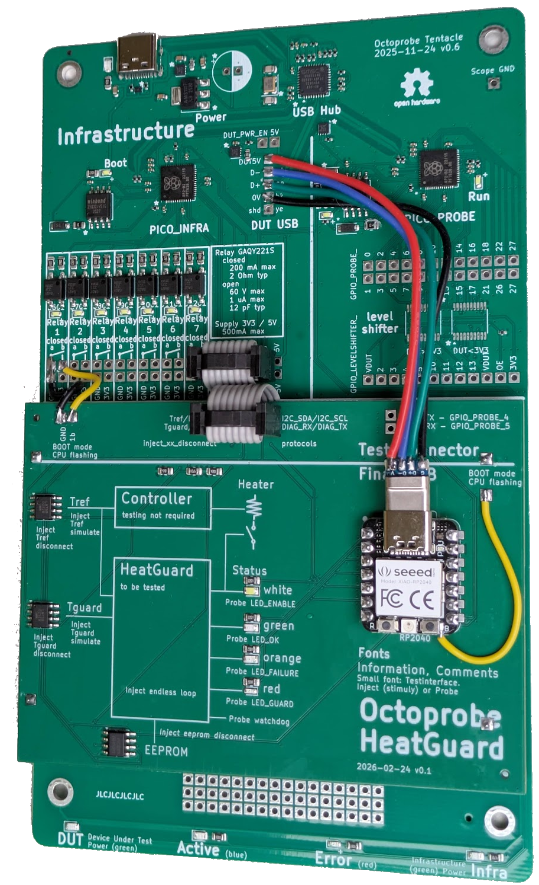

Motivation
===========================

.. note:: 

  `testbed_heatguard` shows best practices of software testing with HIL (Hardware in the Loop).

  The hardware cost of the the `tentacle` PCB and the `heatguard` PCB are below EUR20. This makes it predestinated to learn about octoprobe and evaluate the concepts.

Szenario
----------

In a typical embedded project there are aspects which are difficult to test. In `testbed_headguard`:

* Errors on I2C
* High temperature
* Watchdog recovering crashed software

In `testbed_headguard` we concetrate on these difficult error cases as there is typically no way to test these condition in manual testing.

The product `headguard`
-------------------------

`heatguard` is an embedded device which is used to control temperature for vat pasteurization.

.. image:: images/pcb_top_3D.png
   :width: 500px
   :align: center

`heatguard` consists of two components
^^^^^^^^^^^^^^^^^^^^^^^^^^^^^^^^^^^^^^^^^^^^

* Controller: This is the software which controls the `Heater`. As engineers enhance and tune this code every day, manual testing is sufficient.
* HeatGuard: For safety, the `Heater` has to be switched on under certain conditions. The hardware and software has been developed many years ago. Nobody would notice if this logic starts failing. So we require:

  * The production software shall be tested on a final PCB (HIL).
  * A `Test Connecter` allows to inject errors and probe the state.
  * The tests should run fully automated controlled by CI/CD.
  * A developer should be able to reproduce the tests on his desk.

There are many ways how to build a testsystem. `testbed_headguard` should show best practices:

  * How to intercept hardware (I2C errors, I2C simulation)
  * How to use a diag-uart-interface to probe the state or inject stimuy.
  * How to automate firmware flashing and software download.

.. note:: 

    We do NOT want to test the software on a simulated hardware.
    
    It is required to use the final PCB as this ensures that the real components (temperature sensor, CPU, watchdog) are used.
