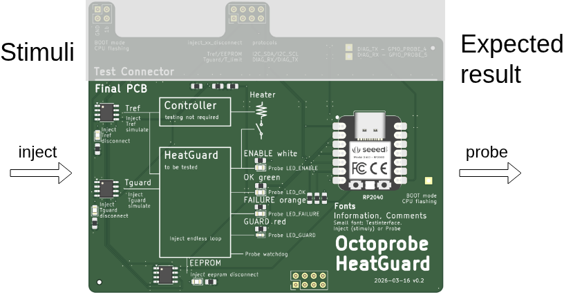

Testconcept
===========================

Example: Testprocedure
-------------------------

* Title: test_Tguard_i2c_error

  * Rationale: Behaviour when a temperature sensor fails
  * Tools: Hardware i2c-error of sensor Tguard
  * Precondition:

    * system up and running
    * LED_OK, LED_ENABLE

* Stimulus: inject i2c-error Tguard

  * Expected result: LED_FAILURE

* Stimulus: inject i2c-error Tguard removed

  * Expected result: LED_OK, LED_ENABLE

Testconnector
-------------------------

.. image:: ../implementation/10_overall_control/testconnector.drawio.png
   :width: 500px
   :align: center

Example stimuly over the diag-uart which would trigger the watchdog

.. code-block:: python

   inject endless_loop

Example probe over the diag-uart which signals a reboot initiated by the watchdog

.. code-block:: python

   probe boot WDT_RESET