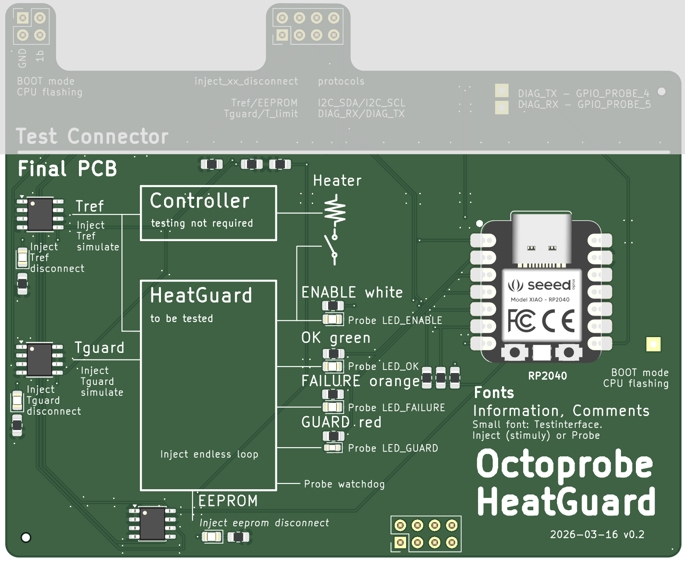

Heatguard Hardware
===========================

:download:`Schematics v0.2 (Pdf) <../../kicad/heatguard_v0.2/production_v0.2/schematics_heatguard_v0.2.pdf>`.

To understand the hardware, just look at the silkscreen carefully. Note that I used a small fonts to describe what was added for the testinterface.

.. note:: 

  The implementation of the `Stimuly (inject)` and `Probes` only has very minimal impact on the `Final PCB`: We do not want to make the final PCB more expensive or bigger!

  The `Test Connector` would be typically implemented using flying probes or a solder pads as this requires minimal space on the PCB and no additional cost.

Assignements of the 8 pin testconnector
-------------------------------------------

.. list-table::
   :header-rows: 1

   * - PICO_INFRA
     - DUT - heatguard
     - Signal
   * - 10
     - \-
     - inject_Tref_disconnect
   * - 11
     - \-
     - inject_EEPROM_disconnect
   * - 12
     - 6
     - SDA
   * - 13
     - 7
     - SCL
   * - 14
     - \-
     - inject_Tguard_disconnect
   * - 15
     - 2
     - inject_T_limit (overwrite Tguard over temperature output)
   * - 16 (tx)
     - 1
     - RX
   * - 17 (rx)
     - 0
     - TX
